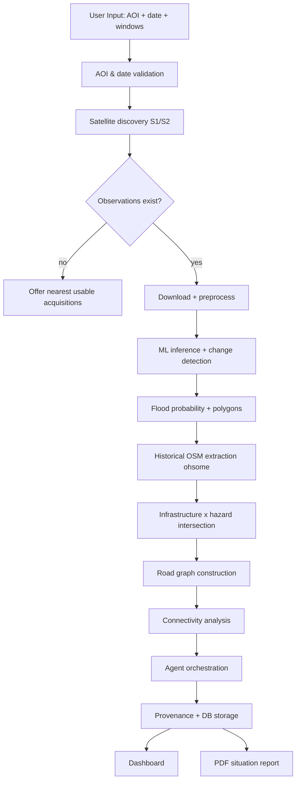

# SATRA — System Architecture Plan

**Project:** SATRA — Satellite-Assisted Terrain & Rescue Analytics
**Related docs:** `01_PRD.md` (source of truth), `03_IMPLEMENTATION.md`, `04_DESIGN.md`
**Status:** v1.0

---

## 1. Architecture Objective

Design a **modular, reproducible** geospatial-intelligence system that processes raw satellite data end-to-end and produces a rescue-intelligence dashboard and report. It must:

- run for a judge-selected AOI and date,
- keep every result traceable to its inputs,
- degrade gracefully when data/credentials are missing,
- never let the LLM produce numbers that did not come from a deterministic tool.

**Design stance:** a **modular monolith** (not microservices) for hackathon speed, with clean seams so the ML inference service, geospatial engine and agent layer can be split later.

---

## 2. Layered Architecture

```
┌──────────────────────────────────────────────────────────────────────┐
│                          PRESENTATION (React + TS)                     │
│  Landing · Config · Dashboard · Connectivity · AI Assistant · Report   │
│  MapLibre GL JS · Recharts · before/after slider · evidence panel      │
└───────────────▲────────────────────────────────────────────────────────┘
                │ REST (JSON / GeoJSON)
┌───────────────┴────────────────────────────────────────────────────────┐
│                     API + ORCHESTRATION (FastAPI)                       │
│  /events /analysis /flood-zones /infrastructure /connectivity          │
│  /agent/query /reports /health · background tasks · input validation   │
└───────────────▲────────────────────────────────────────────────────────┘
                │
┌───────────────┴───────────┬─────────────────┬──────────────────────────┐
│  GEOSPATIAL ENGINE         │  ML ENGINE       │  AGENTIC AI (LangGraph)  │
│  Rasterio/GDAL/GeoPandas   │  PyTorch U-Net   │  Planner→Satellite→      │
│  Shapely · raster→vector   │  inference svc   │  Damage→Connectivity→    │
│  NetworkX connectivity     │  confidence      │  Report · tools (JSON)   │
└───────────────▲────────────┴────────▲────────┴──────────▲───────────────┘
                │                      │                   │
┌───────────────┴──────────────────────┴───────────────────┴──────────────┐
│                        DATA / STORAGE LAYER                              │
│  PostgreSQL + PostGIS (prod) · SQLite/SpatiaLite + files (dev/demo)      │
│  sample_data/ cache · ml/models checkpoints · provenance log            │
└───────────────▲──────────────────────────────────────────────────────────┘
                │
┌───────────────┴──────────────────────────────────────────────────────────┐
│                       EXTERNAL DATA SOURCES                              │
│  Copernicus Data Space (S1/S2) · ohsome API (historical OSM)             │
│  Copernicus DEM GLO-30/90 · Kuro Siwo / Sen1Floods11 (training)          │
└──────────────────────────────────────────────────────────────────────────┘
```

---

## 3. Component Responsibilities

### A. Frontend (React + TypeScript + Vite)
- Screens: Landing, Configure, Dashboard, Connectivity, Assistant, Report.
- MapLibre GL JS for all geospatial layers; basemap switchable (imagery / dark).
- Calls FastAPI only; no analysis logic in the browser.
- Before/after raster slider, layer control, metric cards, risk badges, chat, PDF export.

### B. Backend API (FastAPI)
- Validates and accepts analysis requests; enqueues background jobs.
- Serves GeoJSON, raster tiles/URLs, statistics and reports.
- Enforces provenance: refuses to feed validation-only datasets into analysis.
- Structured errors and input validation.

### C. Satellite Data Layer
- `search.py` — OData catalogue discovery (Sentinel-1 GRD, Sentinel-2 L2A), same-orbit selection.
- `download.py` — OpenID token + product download with redirect handling.
- Records metadata: acquisition time, orbit direction, relative orbit, polarisation, cloud cover.

### D. Geospatial Processing
- Rasterio/GDAL for raster IO, reprojection, tiling, band maths.
- GeoPandas/Shapely for vector intersection, validity repair, spatial index, buffers.
- Raster→vector polygonisation of flood masks.
- DEM terrain analysis for slope/shadow masking and (bonus) flow tracing.

### E. Machine Learning
- PyTorch U-Net for SAR flood segmentation.
- Optional SAR+optical fusion encoder.
- Confidence estimation from sigmoid probabilities.
- Evaluation: IoU, precision, recall, F1; event-level splits.

### F. Infrastructure Intelligence
- Historical OSM via ohsome API (pre-event snapshot).
- Feature classes: buildings, roads (`highway=*`), bridges (`bridge=*`), hospitals, settlements (`place=*`).
- Hazard intersection → exposure classification.

### G. Connectivity Engine
- NetworkX graph from road segments.
- Edge risk classification from hazard intersection.
- Scenario passability graph (baseline preserved).
- Connected components + shortest path to nearest hospital/town.
- Alternative-route search; confidence from data completeness.

### H. Agentic AI
- LangGraph workflow (single deployable, five nodes).
- Agents **call deterministic tools**, never compute numbers themselves.
- Pydantic-validated state and outputs.
- No unrestricted shell/DB access.

---

## 4. Multimodal ML Architecture

### 4.1 SAR flood segmentation (primary)
```
Input tensor (channels)
  c0 = post-event VV        c1 = post-event VH
  c2 = pre-event VV         c3 = pre-event VH
  c4 = VV change (post-pre) c5 = slope (optional)
        │
   ┌────▼────┐   Encoder (down blocks, conv-BN-ReLU ×2 + maxpool)
   │ Encoder │
   └────┬────┘
        │ skip connections
   ┌────▼────┐   Bottleneck
   │  Bridge │
   └────┬────┘
   ┌────▼────┐   Decoder (up-conv + concat skip + conv)
   │ Decoder │
   └────┬────┘
        │
   1×1 conv → C classes (softmax / sigmoid)
```

- **Classes:** `0` background, `1` water/flood, `2` uncertain change/anomaly.
- **Loss:** `L = BCE + Dice` (weighted for class imbalance).
- **Metrics:** IoU, precision, recall, F1 on event-level held-out sets.
- **Preprocessing:** calibration → terrain correction → speckle filter → dB scaling → normalise → tile.
- **Critical distinction:** water segmentation ≠ debris classification. Class 2 is labelled *uncertain change*, never *confirmed debris*.

### 4.2 Optional optical fusion
When cloud-free Sentinel-2 is available and aligned, add B4/B8/B11/B12-derived NDWI/MNDWI channels through a second encoder; fuse at the bottleneck. Terrain is an auxiliary analytical layer, not standalone proof of flooding.

### 4.3 Infrastructure risk scoring (transparent, non-ML)
```
R = w1·F + w2·C + w3·P + w4·I
F = flood overlap, C = detection confidence,
P = proximity to hazard, I = infrastructure importance
```
Documented as a **decision-support score**, not a probability of structural failure.

---

## 5. Data Flow (end-to-end)



**Pipeline order:** `Validate → Discover → Download → Preprocess → Infer → Vectorise → OSM → Intersect → Graph → Connectivity → Agents → Store → Dashboard → Report`.

---

## 6. Database Design (PostgreSQL + PostGIS)

> Dev/demo may use SQLite + SpatiaLite or GeoJSON files; schema is PostGIS-first.

| Table | Key columns | Notes |
|---|---|---|
| `users` | id PK, name, role | roles: coordinator/analyst/planner/researcher |
| `disaster_events` | id PK, name, disaster_date, event_type, aoi_id FK | |
| `areas_of_interest` | id PK, name, geom GEOMETRY(Polygon,4326), bbox | spatial index |
| `satellite_observations` | id PK, aoi_id FK, sensor, product_id, acquired_at, orbit_direction, rel_orbit, polarisation, cloud_cover, role(pre/post) | |
| `analysis_runs` | id PK, event_id FK, status, started_at, finished_at, model_version, params JSONB | |
| `flood_zones` | id PK, run_id FK, geom GEOMETRY(MultiPolygon,4326), class, prob_mean, confidence | |
| `infrastructure` | id PK, run_id FK, osm_id, feature_type, geom, exposure_class, confidence | |
| `road_segments` | id PK, run_id FK, osm_id, highway, geom GEOMETRY(LineString), hazard_status | |
| `settlements` | id PK, aoi_id FK, osm_id, name, geom POINT, population_est | |
| `connectivity_results` | id PK, run_id FK, settlement_id FK, nearest_hospital, status, alt_route_geom, confidence | |
| `model_predictions` | id PK, run_id FK, tile_id, model_version, prob_raster_path, metrics JSONB | |
| `agent_logs` | id PK, run_id FK, agent, tool_called, input JSONB, output JSONB, created_at | provenance |
| `situation_reports` | id PK, run_id FK, language, body_md, pdf_path, created_at | |

**Relationships:** `areas_of_interest 1—* disaster_events 1—* analysis_runs 1—* {flood_zones, infrastructure, road_segments, connectivity_results, model_predictions, agent_logs, situation_reports}`; `analysis_runs *—* satellite_observations` via link table; `settlements 1—* connectivity_results`.

**Provenance guard:** `satellite_observations.role` and a `source_class` enum (`ALLOWED_INPUT` / `VALIDATION_ONLY`) ensure EMSR927 etc. can never be selected as an inference input.

---

## 7. API Design

Base: `/api`. JSON unless noted.

| Method | Path | Purpose |
|---|---|---|
| GET | `/health` | liveness |
| POST | `/events` | create disaster event + AOI |
| GET | `/events/{id}` | event detail |
| POST | `/analysis` | start analysis run (returns run_id) |
| GET | `/analysis/{id}` | status + summary |
| GET | `/flood-zones/{id}` | GeoJSON flood polygons |
| GET | `/infrastructure/{id}` | GeoJSON infrastructure by class |
| GET | `/connectivity/{id}` | cut-off settlement results |
| POST | `/agent/query` | grounded agent Q&A |
| GET | `/reports/{id}` | situation report (+PDF) |
| GET | `/satellite/search` | discovery helper |
| GET | `/sample-flood` | clearly-labelled demo layer |

**Example — start analysis**
```http
POST /api/analysis
{
  "aoi": {"name": "Syapru Besi", "bbox": [85.2, 28.0, 85.6, 28.4]},
  "disaster_date": "2026-08-26",
  "pre_window": ["2026-08-01", "2026-08-14"],
  "post_window": ["2026-08-26", "2026-09-05"],
  "sensors": ["S1"],
  "demo_mode": true
}
→ 202 { "run_id": "SATRA-0001", "status": "queued" }
```

**Example — agent query**
```http
POST /api/agent/query
{ "run_id": "SATRA-0001", "question": "Which settlements may have lost road access to hospitals?" }
→ 200 {
  "answer": "...",
  "evidence": [{"tool":"get_disconnected_settlements","result_ref":"...","count":7}],
  "sources": ["ohsome OSM 2026-07-27", "Sentinel-1 2026-08-30"],
  "confidence": "medium"
}
```

**Status codes:** 200 OK · 201 Created · 202 Accepted · 400 validation · 404 not found · 409 conflict/state · 422 schema · 500 server. Errors return `{ "detail": "...", "code": "..." }`.

---

## 8. Data Provenance

Every analytical result stores: input dataset, observation date, processing date, model version, parameters, confidence, processing status. The agent layer logs every tool call. Validation-only sources are tagged and blocked from the inference path.

---

## 9. Deployment Architecture

```
docker-compose (optional)
 ├─ api        (FastAPI + geospatial deps)
 ├─ ml-infer   (PyTorch inference; CPU by default)
 ├─ db         (PostgreSQL + PostGIS)
 └─ web        (static React build / nginx)
```
- `.env` for secrets; never committed.
- Dev: `uvicorn` + `vite` locally, file-based cache in `sample_data/`.
- **Avoid** Kubernetes / many microservices for the hackathon.

---

## 10. Security & Reliability

- API keys & credentials only in `.env`.
- Pydantic validation on every request.
- Agent tools are an allow-list of typed functions; **no** arbitrary shell/DB.
- Human review required for high-impact decisions; outputs labelled as assessments.
- Structured logging + agent audit trail.
- Idempotent, cached data downloads; resumable jobs.

---

## 11. Key Technology Decisions

| Decision | Choice | Why |
|---|---|---|
| Segmentation model | U-Net | simple, proven, pixel-level, trainable |
| Primary sensor | Sentinel-1 SAR | works through cloud/monsoon |
| Historical OSM | ohsome API | timestamped, reproducible baseline |
| Connectivity | NetworkX | standard, fast, hackathon-friendly |
| Agent framework | LangGraph | controlled workflow, structured state |
| Backend | FastAPI | async, typed, fast to build |
| Map | MapLibre GL JS | open, vector/raster flexible |
| Architecture | modular monolith | speed + clear seams |
