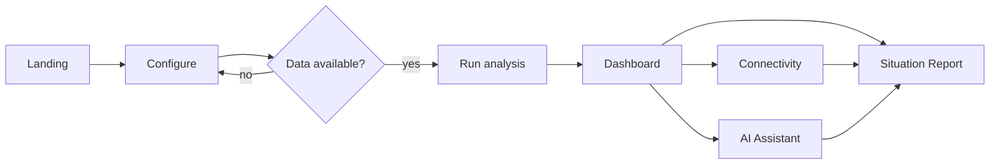

# SATRA — UI/UX Design Plan

**Aesthetic:** Emergency Command Center (ECC) — dark geospatial intelligence.
**Companion docs:** `01_PRD.md`, `02_ARCHITECTURE.md`, `03_IMPLEMENTATION.md`.

---

## 1. Design Objective

Users must, at a glance, understand: **where** the disaster is, **what** is detected, **which** infrastructure is exposed, **who** is cut off, and **what the AI recommends to investigate**. Prioritise clarity, speed, trust and geographic context — not decoration.

---

## 2. Visual Identity

### 2.1 Colour tokens (semantic)
| Token | Hex | Meaning |
|---|---|---|
| `--bg` | `#0b1220` | deep navy background |
| `--surface` | `#0f1b33` | panels/cards |
| `--border` | `#1e2d4d` | subtle borders |
| `--cyan` | `#22d3ee` | informational / selected |
| `--blue` | `#3b82f6` | secondary accent |
| `--danger` | `#ef4444` | high-priority hazard |
| `--warn` | `#f59e0b` | uncertain / moderate |
| `--ok` | `#22c55e` | no detected concern |
| `--text` | `#e5e7eb` | primary text |
| `--muted` | `#94a3b8` | secondary text |

> Green means "no concern in the analysed layers", **never** "safe". Always pair colour with a text label and icon.

### 2.2 Typography
- Family: **Inter** (fallback `system-ui, sans-serif`).
- Scale: `12 / 13 / 14 / 16 / 20 / 28 / 40` px. Headings 600–700; body 400.

### 2.3 Spacing & components
- 4px base grid; panel padding 16px; card radius 10px; borders 1px.
- Risk badges: pill, coloured bg at 15% opacity + solid text + label.
- No excessive neon/animations. Motion only for loading/progress.

### 2.4 Accessibility
- Contrast ≥ 4.5:1; colour never the only signal; focus rings; keyboard-navigable panels; prefers-reduced-motion respected.

---

## 3. Screens

### SCREEN 1 — Landing
SATRA wordmark · tagline *From Space to Safety* · 1-paragraph pitch · **Start analysis** · *View case study* · data & limitation note.

### SCREEN 2 — Disaster Configuration
Location search · AOI draw/bbox · disaster date · pre/post windows · satellite-availability validation banner · **Run analysis**.
Wireframe:
```
┌ SATRA · Configure ────────────────────────────────┐
│ Location [ search............ ]  [ Draw AOI ]     │
│ Disaster date [2026-08-26]                         │
│ Pre  [08-01 → 08-14]   Post [08-26 → 09-05]        │
│ ✓ Sentinel-1 available (2 scenes)                  │
│ ⚠ Sentinel-2 cloud cover 85% — SAR will be primary │
│                                   [ Run analysis ] │
└────────────────────────────────────────────────────┘
```

### SCREEN 3 — Main Dashboard (three-panel)
```
┌───────────────┬───────────────────────────────┬────────────────┐
│ LEFT          │            MAP                │ RIGHT          │
│ Event details │  before/after slider          │ Summary        │
│ Progress      │  flood polygons               │ Flood stats    │
│ Layer control │  roads / buildings / bridges  │ Infra exposure │
│ Data sources  │  hospitals / settlements      │ Cut-off list   │
│ Filters       │  cut-off markers              │ Confidence     │
└───────────────┴───────────────────────────────┴────────────────┘
```

### SCREEN 4 — Connectivity
Settlement table (name · nearest hospital · road status · alt route · confidence) + map focus + legend for Connected / No modelled connection / Insufficient data / Uncertain.

### SCREEN 5 — AI Assistant
Question input · suggested questions · **tool-execution status** (which tool ran) · evidence-backed answer · source references · confidence.
Suggested prompts:
- Which settlements may be disconnected from hospitals?
- Show roads intersecting high-confidence flood zones.
- Which buildings are potentially exposed?
- Generate a one-page disaster situation report.

### SCREEN 6 — Situation Report
One-page preview: event summary · map snapshot · verified stats · priority observations · data sources · limitation note · **Download PDF**.

---

## 4. Map Design (MapLibre GL JS)

- Basemaps: satellite imagery (default) + dark vector.
- Layer order (bottom→top): basemap → flood fill → uncertain change → roads → buildings → bridges → hospitals → settlements → cut-off markers → selection highlight.
- Interactions: hover tooltip; click feature → detail panel; before/after slider; zoom controls; legend; scale bar.
- Layer groups are individually toggleable; opacity sliders for rasters.
- Every layer carries a data-quality chip (source + date + confidence).

---

## 5. Reusable React Components

`DashboardLayout` · `AnalysisHeader` · `MapPanel` · `LayerControl` · `MetricCard` · `RiskBadge` · `SettlementTable` · `EvidencePanel` · `AgentChat` · `ReportPreview` · `LoadingState` · `ErrorState` · `DataQualityBanner` · `BeforeAfterSlider`.

Component hierarchy:
```
App
└── DashboardLayout
    ├── AnalysisHeader
    ├── LeftPanel(LayerControl, DataSourceList, Filters)
    ├── MapPanel(BeforeAfterSlider, Legend, FeaturePopup)
    └── RightPanel(MetricCard[], SettlementTable, EvidencePanel)
```

---

## 6. UX Behaviour

- **On start:** disable button, show real staged progress from backend (never fake percentages).
- **Data unavailable:** explain nearest usable acquisition dates.
- **Uncertain output:** amber styling + explicit "uncertain" label.
- **Inspect feature:** click → detail panel with source/date/confidence.
- **Export:** report page → PDF; layers → GeoJSON.
- **Agent:** show which tools were called; if evidence missing, the answer says so.

---

## 7. Responsive Design

Desktop-first (coordination rooms). Left/right panels collapse to drawers on tablets; map stays primary. Minimum supported width 1024px; graceful 768px fallback.

---

## 8. User Flow



---

## 9. Deliverables Checklist

- [ ] Colour tokens implemented as CSS variables.
- [ ] All 6 screens built and navigable.
- [ ] Map layers + legend + before/after slider working.
- [ ] Risk badges semantic + labelled.
- [ ] AI chat shows tool trace.
- [ ] Report preview exports to PDF.
- [ ] Loading/error/data-quality states present.
