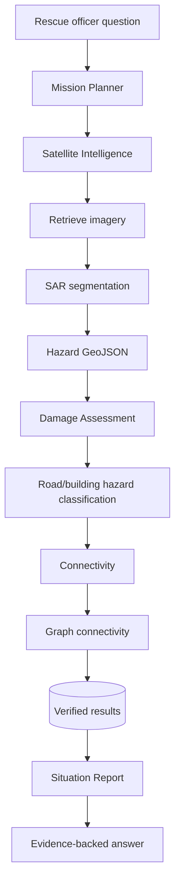

# SATRA — Multimodal ML + Agentic AI Integration Guide

This document explains, in plain language, **how the machine learning and the agentic AI fit together** and exactly how to wire them into SATRA.

---

## 1. What "multimodal" means here

SATRA combines four different *types* of data:

| Modality | Example | Handled by |
|---|---|---|
| Radar (SAR) | Sentinel-1 VV/VH | U-Net segmentation |
| Optical | Sentinel-2 B2/B3/B4/B8/B11/B12 | Indices + optional fusion encoder |
| Elevation | Copernicus DEM | Auxiliary terrain layer |
| Geospatial vectors | OSM roads/buildings/settlements | GIS + graph algorithms |

**You do NOT need one giant vision-language model.** The scientifically defensible split is:

```
U-Net (CNN)          → "what pixels look flooded"
Geospatial algorithms → "what infrastructure intersects it"
Graph algorithm       → "what settlements are cut off"
LLM                   → "explain and report, using only tool outputs"
```

This is both easier to build and easier to defend to judges.

---

## 2. ML architecture

### Model 1 — SAR flood segmentation (primary)
- **Input channels:** post VV, post VH, pre VV, pre VH, VV change (post−pre), optional slope.
- **Architecture:** U-Net (encoder → bottleneck → decoder with skip connections).
- **Output classes:** `0` background, `1` water/flood, `2` uncertain change/anomaly.
- **Loss:** `L = BCE + Dice`.
- **Metrics:** IoU, precision, recall, F1 — evaluated on **event-level** held-out scenes.
- **Rule:** a water dataset does NOT give debris labels. Never label class 2 as confirmed debris without independent validation.

### Model 2 — Multimodal fusion (stretch)
SAR encoder + optical encoder → fusion at bottleneck → decoder. Use SAR+optical only when optical is cloud-free and co-registered. Treat DEM as auxiliary analysis, not proof.

### Model 3 — Infrastructure risk scoring (transparent, not a neural net)
```
R = w1·F + w2·C + w3·P + w4·I
```
F = flood overlap · C = detection confidence · P = proximity to hazard · I = infrastructure importance.
Present it as a **decision-support score**, not a probability of failure.

---

## 3. Agentic AI architecture

### The five agents
| Agent | Responsibility | Tools |
|---|---|---|
| Mission Planner | validate request, build workflow | date/AOI validation |
| Satellite Intelligence | retrieve + inference | Sentinel API, segmentation |
| Damage Assessment | infrastructure exposure | raster×vector intersection |
| Connectivity | cut-off settlements | NetworkX, routing |
| Situation Report | evidence-backed report/Q&A | DB queries, report generator |

### Workflow


### The golden rule: tool-grounded AI
The LLM must **never calculate or invent** statistics. Give it structured tools:

```python
get_flood_statistics(aoi_id)
get_affected_buildings(aoi_id)
get_affected_roads(aoi_id)
get_disconnected_settlements(aoi_id)
get_nearest_alternative_hospital(settlement_id)
generate_situation_report(analysis_id)
```

Each returns structured JSON, e.g.:
```json
{
  "analysis_id": "SATRA-0001",
  "disconnected_settlements": [
    {
      "name": "Example Village",
      "nearest_hospital": "Example Hospital",
      "road_connection": "unavailable",
      "reason": "All modelled paths intersect high-confidence hazard segments",
      "confidence": "medium"
    }
  ],
  "data_timestamp": "2026-08-30",
  "source": "SATRA geospatial analysis"
}
```
The model may summarise this evidence but **cannot alter it**.

### Recommended stack
Python · **LangGraph** (controlled multi-agent flow) · **Pydantic** (structured output) · **FastAPI** (tools as endpoints) · Postgres/PostGIS · an LLM for reasoning · a separate ML inference service.

> Hackathon tip: implement the five roles as **one LangGraph workflow with separate nodes**, not five autonomous services. Simpler and more reliable to demo.

### Deterministic fallback
If no LLM key is configured, SATRA still works: the report agent uses templates filled from tool outputs. This guarantees the demo never depends on network/LLM availability.

---

## 4. How to wire it into the repo

```
agents/
├── state.py   # typed SatraState (analysis_id, aoi_id, results, evidence, report)
├── tools.py   # deterministic functions (the only source of numbers)
├── nodes/
│   ├── planner.py
│   ├── satellite.py
│   ├── damage.py
│   ├── connectivity.py
│   └── report.py
└── graph.py   # LangGraph wiring + fallback runner
```

**State (simplified):**
```python
class SatraState(TypedDict):
    analysis_id: str
    aoi_id: str
    event_date: str
    satellite_status: str
    flood_map_path: str | None
    infrastructure_results: dict
    connectivity_results: dict
    evidence: list
    report: str | None
    errors: list
```

**Node (simplified):**
```python
def satellite_agent(state: SatraState):
    result = analyze_flood_extent(state["analysis_id"])
    return {"flood_map_path": result["map_path"], "satellite_status": "completed"}
```

**Report agent system rules:** never invent numbers; use only provided evidence; distinguish detected hazards from confirmed damage; state observation dates; explain uncertainty; never claim to locate missing people; say when evidence is missing; keep it concise; preserve sources.

---

## 5. Reference questions for the assistant
- Which settlements may be disconnected from hospitals?
- Show roads intersecting high-confidence flood zones.
- Which buildings are potentially exposed?
- Generate a one-page disaster situation report.
- Explain the uncertainty in the detected flood boundary.

Route these to your `/api/agent/query` endpoint — never to a generic chatbot.

---

## 6. Bonus — Downstream flood-path tracing
```
DEM → depression treatment → flow direction → flow accumulation →
stream network → upstream point → downstream trace → settlement intersection → corridor
```
Tools: WhiteboxTools, RichDEM, GRASS, Rasterio, PySheds.
**Limitation:** a DEM drainage path is **not** a physical flood simulation — it cannot predict depth, velocity, debris or a GLOF extent. Implement it only after the core three questions work.

---

## 7. Rescue Priority Intelligence Engine (innovation feature)
Combine the three mandatory questions into one ranked view. For a settlement with one mapped road to a hospital, that road intersecting a high-confidence hazard, no alternative route, and location in the downstream corridor → flag **High-priority verification**, with an explanation and a safe recommended next step (verify via field reports / official sources).

```
Pi = w1·Hazard + w2·ConnectivityLoss + w3·SettlementExposure + w4·(fewer alternatives)
```
Normalise variables, document weights, and present as a transparent prioritisation — not an official rescue ranking.
